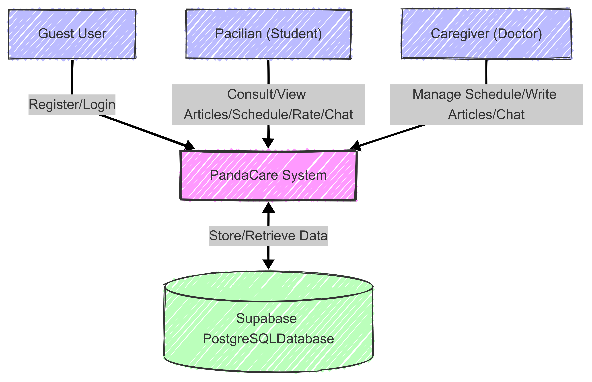
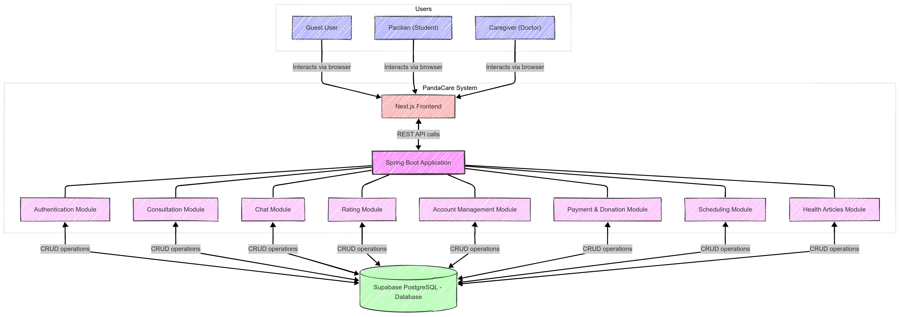
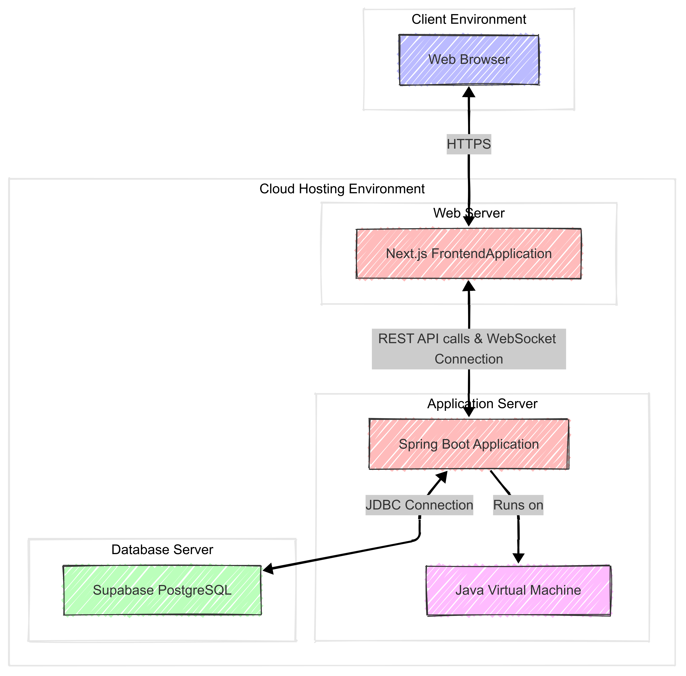
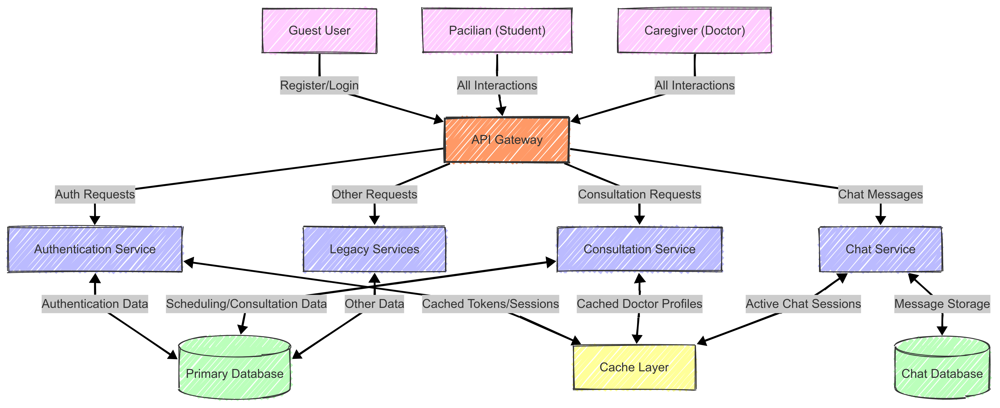
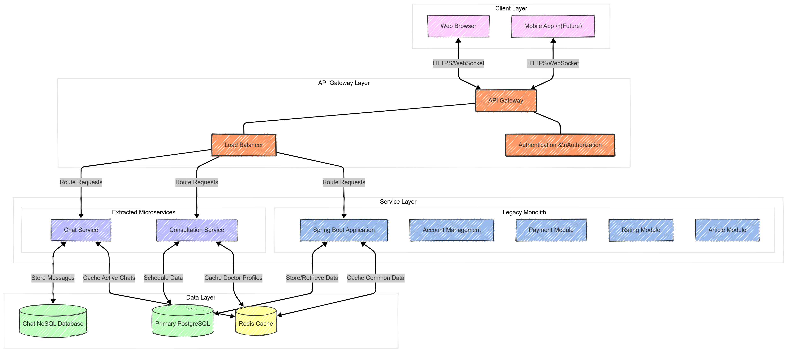
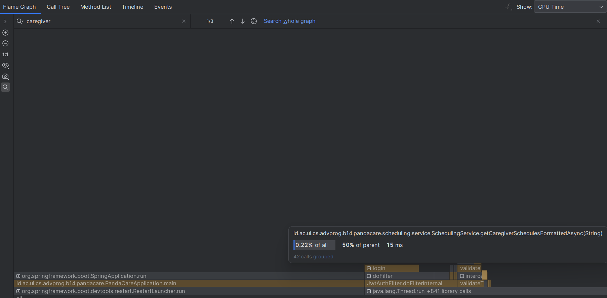
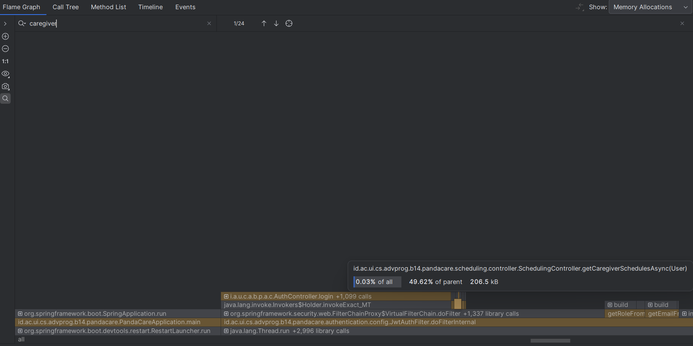
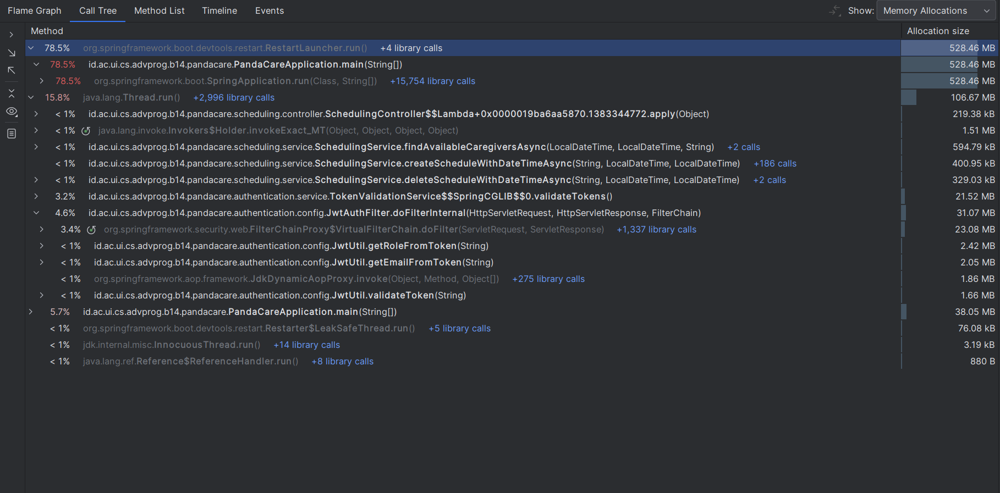

# PandaCare

## Module 9 Tutorial B

### 1. Deliverable G1

#### A. Context Diagram



#### B. Container Diagram



#### C. Deployment Diagram



### 2. Deliverable G2

#### A. Risk Analysis

After analyzing our current modular monolith architecture, we've identified several potential risks that could emerge as PandaCare grows in popularity and usage:

1. **Scalability Limitations**

   - Single Spring Boot application may struggle with high user load
   - Monolithic database could become a performance bottleneck
   - Real-time chat features require different scaling patterns than other services

2. **Reliability Concerns**

   - Single point of failure in the monolithic architecture
   - Maintenance downtime affects all system features
   - No effective isolation between critical and non-critical components

3. **Development & Deployment Challenges**

   - Growing codebase complexity despite modularization
   - Deployment of the entire application for single feature updates
   - Testing becomes increasingly complex with interdependent modules

4. **Resource Efficiency Issues**
   - Inefficient resource allocation (all modules scale together)
   - Uneven resource utilization (some modules require more processing power)
   - Limited ability to optimize specific modules independently

#### B. Updated Context Diagram



#### C. Updated Container Diagram



### 3. Deliverable G3

#### Risk Analysis and Architecture Modification Justification

The Risk Storming technique has been applied to our PandaCare project to identify potential architectural risks as the application grows in popularity and user base. This proactive approach allows us to anticipate and mitigate issues before they manifest as critical problems. Our risk assessment revealed several key concerns with our current modular monolith architecture that needed to be addressed.

The primary risks identified include scalability limitations, reliability concerns, deployment challenges, and resource inefficiency. While our modular monolith has served us well during initial development, allowing for rapid feature implementation and simplified team coordination, it would face significant challenges under increased load. In particular, the real-time communication features like chat would require different scaling patterns compared to other services. Additionally, the single deployment unit creates a risk of system-wide failures and complicated release processes as the codebase grows.

To address these risks, we've proposed a hybrid architecture that preserves the benefits of our monolithic approach while strategically extracting high-risk components into independent microservices. By moving chat and consultation scheduling into separate services with their own dedicated resources, we can scale them independently according to their unique usage patterns. The introduction of an API gateway provides a unified entry point for all client requests while enabling advanced routing, load balancing, and security features. A distributed caching layer further enhances performance by storing frequently accessed data such as authentication tokens and doctor profiles closer to the computation.

This architectural evolution represents a pragmatic balance between operational simplicity and system resilience. Rather than undertaking a risky complete rewrite to microservices, we've chosen a targeted approach that addresses our most pressing concerns while maintaining the productivity advantages of our modular monolith. This strategy allows us to gradually transition toward a more distributed architecture as the application's needs evolve, following the principle of "evolve, don't rewrite."

## Deployment Information

This project uses Docker and GitHub Actions for CI/CD deployment to AWS.

### Local Development

To run the application locally:

```bash
./gradlew bootRun
```

### Docker

To build and run with Docker:

```bash
# Build the Docker image
docker build -t pandacare:latest .

# Run the container
docker run -p 8080:8080 pandacare:latest
```

Or using Docker Compose:

```bash
docker-compose up
```

### CI/CD Pipeline

The application is automatically deployed to AWS when changes are pushed to the `staging` branch. The deployment process:

1. Builds the application with Gradle
2. Runs tests
3. Creates a Docker image
4. Deploys the Docker image to AWS EC2

Required GitHub Secrets:

- `AWS_HOST`: The AWS EC2 host address
- `AWS_SSH_PRIVATE_KEY`: SSH private key for connecting to EC2
- `AWS_USERNAME`: Username for SSH connection

### Profiling





