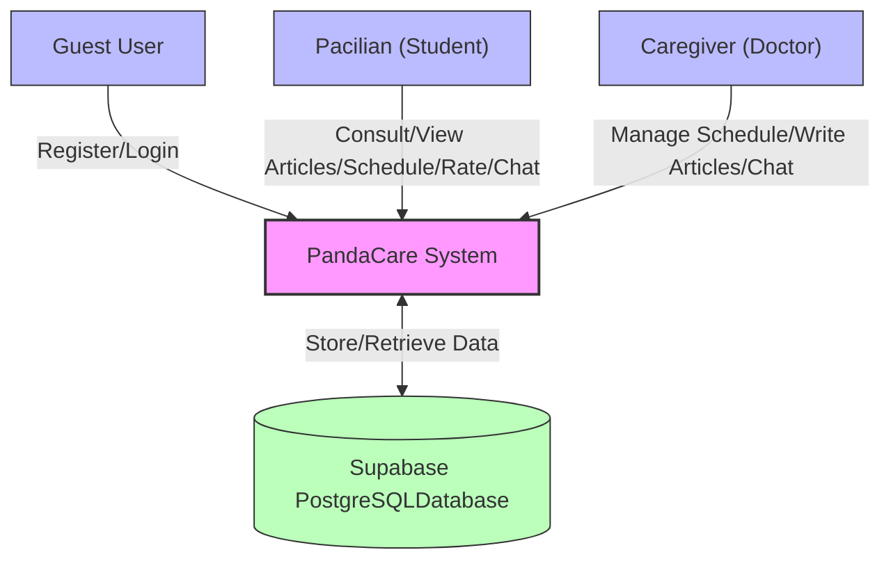
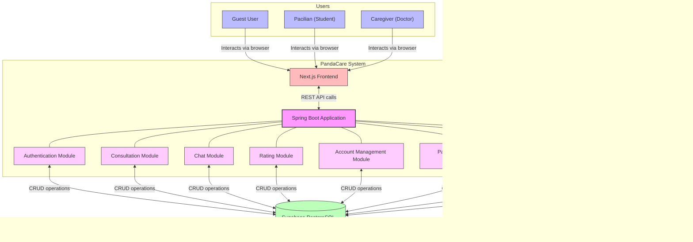
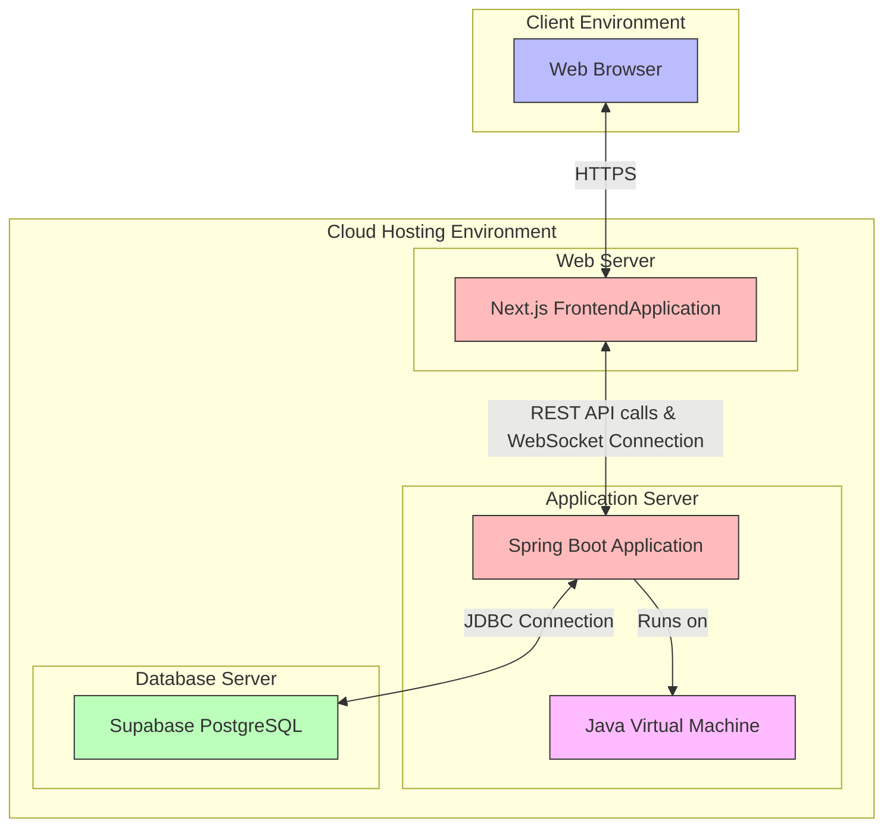

# PandaCare System Architecture - Deliverable G1

## Context Diagram

```mermaid
flowchart TD
    Guest["Guest User"]
    Pacil["Pacilian (Student)"]
    Care["Caregiver (Doctor)"]
    Sys["PandaCare System"]
    DB[("Supabase PostgreSQLDatabase")]

    Guest -->|Register/Login| Sys
    Pacil -->|Consult/View Articles/Schedule/Rate/Chat| Sys
    Care -->|Manage Schedule/Write Articles/Chat| Sys
    Sys <-->|Store/Retrieve Data| DB

    classDef system fill:#f9f,stroke:#333,stroke-width:2px
    classDef user fill:#bbf,stroke:#333,stroke-width:1px
    classDef db fill:#bfb,stroke:#333,stroke-width:1px

    class Sys system
    class Guest,Pacil,Care user
    class DB db
```

## Container Diagram

```mermaid
flowchart TD
    subgraph Users
        Guest["Guest User"]
        Pacil["Pacilian (Student)"]
        Care["Caregiver (Doctor)"]
    end

    subgraph "PandaCare System"
        UI["Next.js Frontend"]
        API["Spring Boot Application"]
        Auth["Authentication Module"]
        Consul["Consultation Module"]
        Chat["Chat Module"]
        Rating["Rating Module"]
        Acct["Account Management Module"]
        PayDon["Payment & Donation Module"]
        Sched["Scheduling Module"]
        Article["Health Articles Module"]
    end

    DB[("Supabase PostgreSQL - Database")]

    Guest -->|"Interacts via browser"| UI
    Pacil -->|"Interacts via browser"| UI
    Care -->|"Interacts via browser"| UI

    UI <-->|"REST API calls"| API

    API --- Auth
    API --- Consul
    API --- Chat
    API --- Rating
    API --- Acct
    API --- PayDon
    API --- Sched
    API --- Article

    Auth <-->|"CRUD operations"| DB
    Consul <-->|"CRUD operations"| DB
    Chat <-->|"CRUD operations"| DB
    Rating <-->|"CRUD operations"| DB
    Acct <-->|"CRUD operations"| DB
    PayDon <-->|"CRUD operations"| DB
    Sched <-->|"CRUD operations"| DB
    Article <-->|"CRUD operations"| DB

    classDef system fill:#f9f,stroke:#333,stroke-width:2px
    classDef module fill:#fcf,stroke:#333,stroke-width:1px
    classDef user fill:#bbf,stroke:#333,stroke-width:1px
    classDef db fill:#bfb,stroke:#333,stroke-width:1px
    classDef ui fill:#fbb,stroke:#333,stroke-width:1px

    class API system
    class Auth,Consul,Chat,Rating,Acct,PayDon,Sched,Article module
    class Guest,Pacil,Care user
    class DB db
    class UI ui
```

## Deployment Diagram

```mermaid
flowchart TD
    subgraph "Client Environment"
        Browser["Web Browser"]
    end

    subgraph "Cloud Hosting Environment"
        subgraph "Web Server"
            Next["Next.js FrontendApplication"]
        end

        subgraph "Application Server"
            Spring["Spring Boot Application"]
            JVM["Java Virtual Machine"]
        end

        subgraph "Database Server"
            Supabase["Supabase PostgreSQL"]
        end
    end

    Browser <-->|"HTTPS"| Next
    Next <-->|"REST API calls & WebSocket Connection"| Spring
    Spring -->|"Runs on"| JVM
    Spring <-->|"JDBC Connection"| Supabase

    classDef client fill:#bbf,stroke:#333,stroke-width:1px
    classDef server fill:#fbb,stroke:#333,stroke-width:1px
    classDef db fill:#bfb,stroke:#333,stroke-width:1px
    classDef runtime fill:#fbf,stroke:#333,stroke-width:1px

    class Browser client
    class Next,Spring server
    class Supabase db
    class JVM runtime
```
