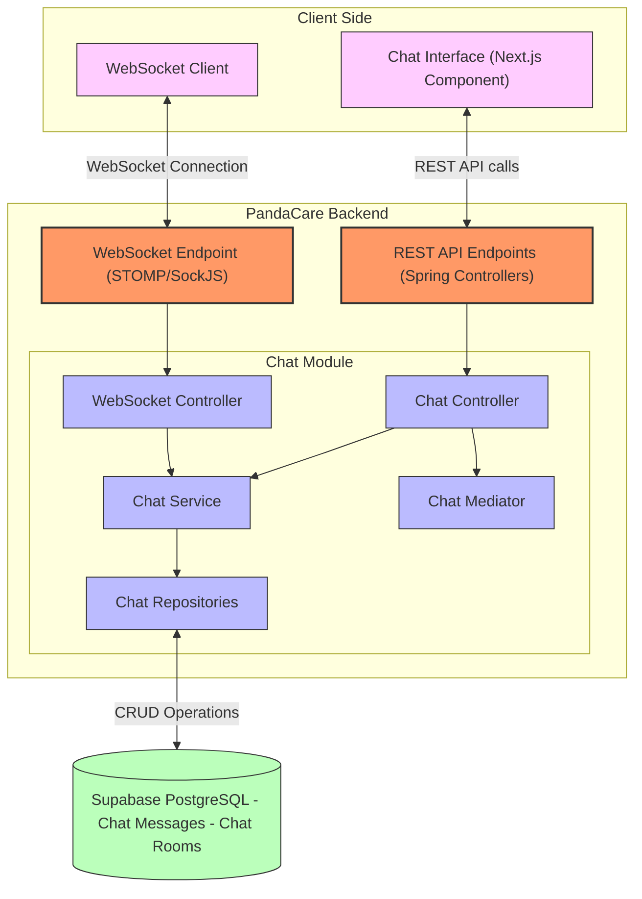
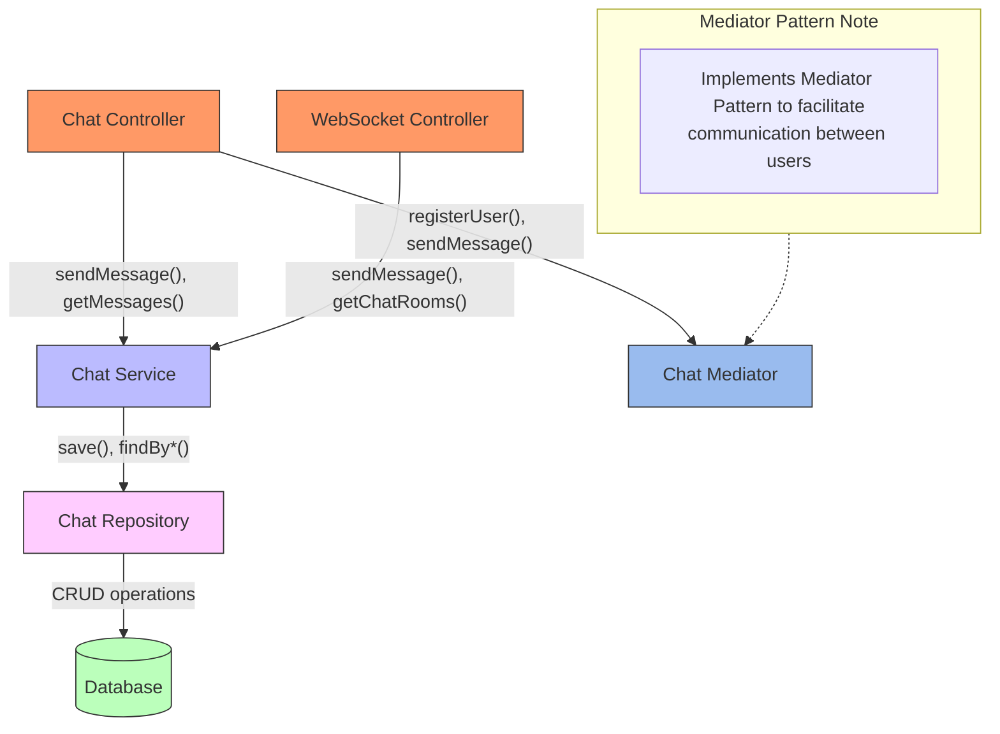
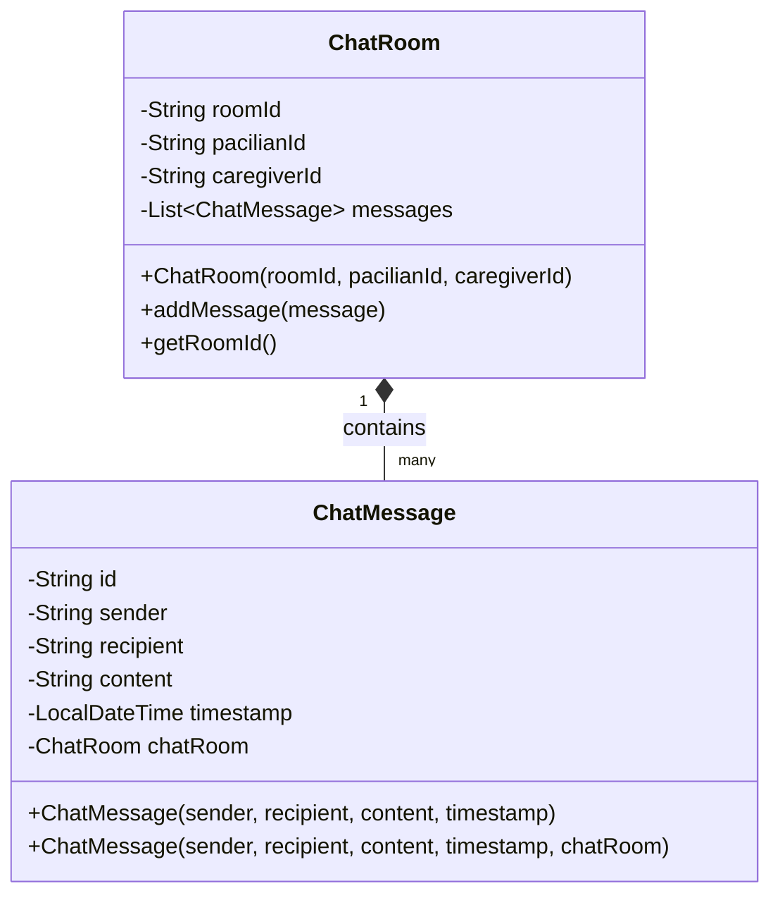
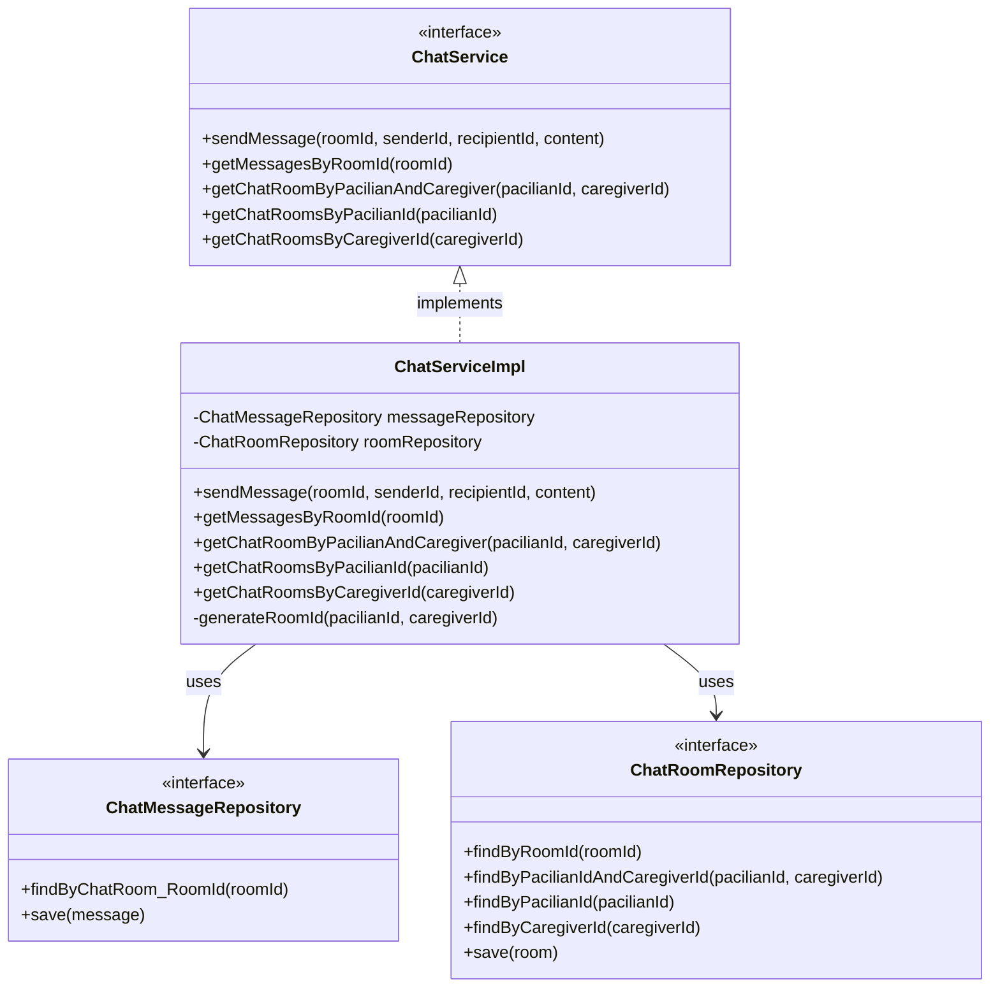
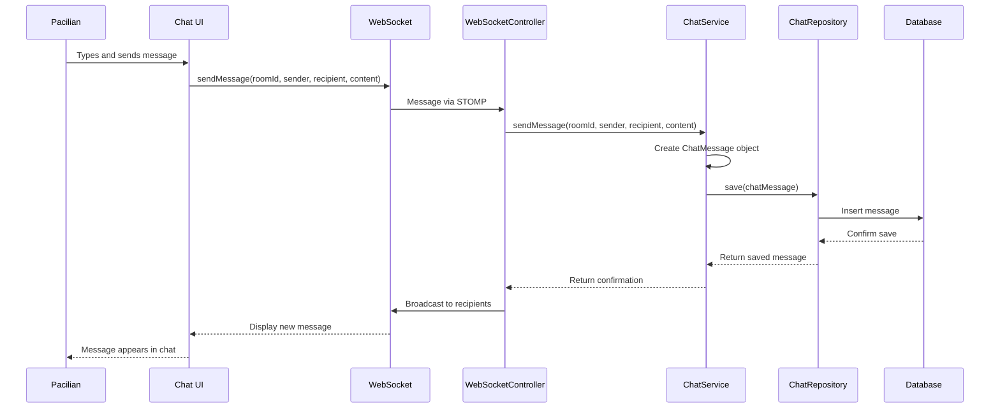

# PandaCare Chat Module Architecture - Individual Contribution (G4)

## Container Diagram for Chat Module

## Component Diagram for Chat Module

## Class Diagram - Chat Module Models

## Class Diagram - Chat Module Services

## Sequence Diagram - Sending a Chat Message

