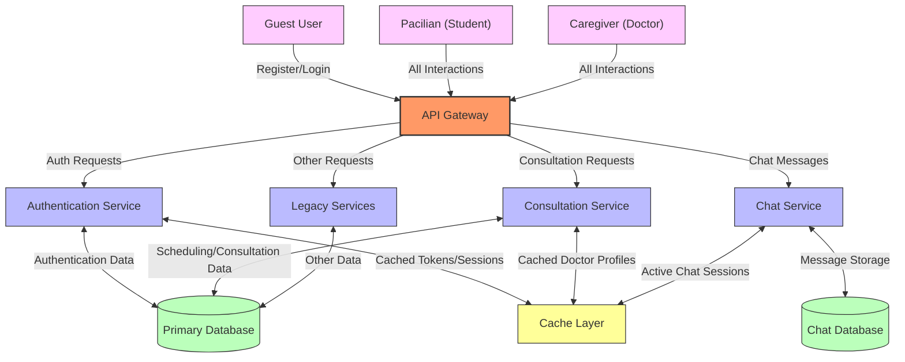
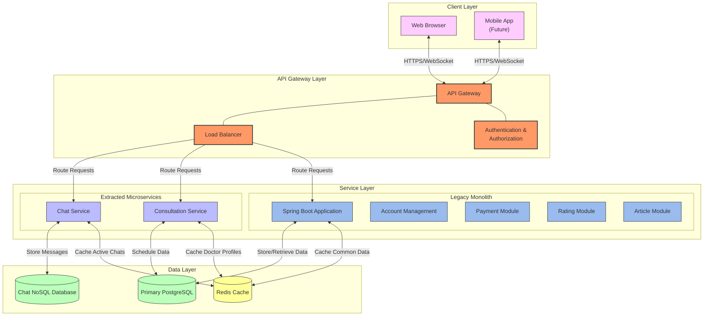

# PandaCare System Architecture - Risk Analysis and Future Architecture (G2)

## Risk Analysis Summary

After analyzing our current modular monolith architecture, we've identified several potential risks that could emerge as PandaCare grows in popularity and usage:

1. **Scalability Limitations**

   - Single Spring Boot application may struggle with high user load
   - Monolithic database could become a performance bottleneck
   - Real-time chat features require different scaling patterns than other services

2. **Reliability Concerns**

   - Single point of failure in the monolithic architecture
   - Maintenance downtime affects all system features
   - No effective isolation between critical and non-critical components

3. **Development & Deployment Challenges**

   - Growing codebase complexity despite modularization
   - Deployment of the entire application for single feature updates
   - Testing becomes increasingly complex with interdependent modules

4. **Resource Efficiency Issues**
   - Inefficient resource allocation (all modules scale together)
   - Uneven resource utilization (some modules require more processing power)
   - Limited ability to optimize specific modules independently

## Updated Context Diagram

## Updated Container Diagram

